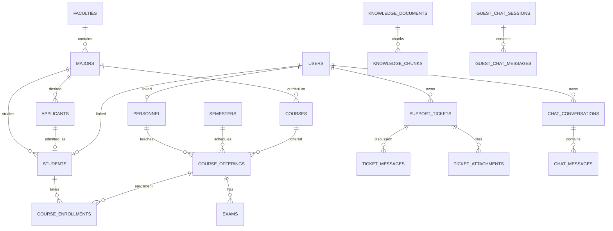

# ERD

```mermaid
erDiagram
 USERS ||--o| STUDENTS : linked
 USERS ||--o| PERSONNEL : linked
 USERS ||--o{ SUPPORT_TICKETS : owns
 USERS ||--o{ CHAT_CONVERSATIONS : owns
 APPLICANTS ||--o| STUDENTS : admitted_as
 FACULTIES ||--o{ MAJORS : contains
 MAJORS ||--o{ STUDENTS : studies
 MAJORS ||--o{ APPLICANTS : desired
 MAJORS ||--o{ COURSES : curriculum
 COURSES ||--o{ COURSE_OFFERINGS : offered
 SEMESTERS ||--o{ COURSE_OFFERINGS : schedules
 PERSONNEL ||--o{ COURSE_OFFERINGS : teaches
 COURSE_OFFERINGS ||--o{ COURSE_ENROLLMENTS : enrollment
 STUDENTS ||--o{ COURSE_ENROLLMENTS : takes
 COURSE_OFFERINGS ||--o{ EXAMS : has
 SUPPORT_TICKETS ||--o{ TICKET_MESSAGES : discussion
 SUPPORT_TICKETS ||--o{ TICKET_ATTACHMENTS : files
 CHAT_CONVERSATIONS ||--o{ CHAT_MESSAGES : contains
 KNOWLEDGE_DOCUMENTS ||--o{ KNOWLEDGE_CHUNKS : chunks
 GUEST_CHAT_SESSIONS ||--o{ GUEST_CHAT_MESSAGES : contains
```

Sơ đồ module-level, quan hệ lấy từ FK/unique trong `entities.py`; không thay thế schema introspection cho production DB.
